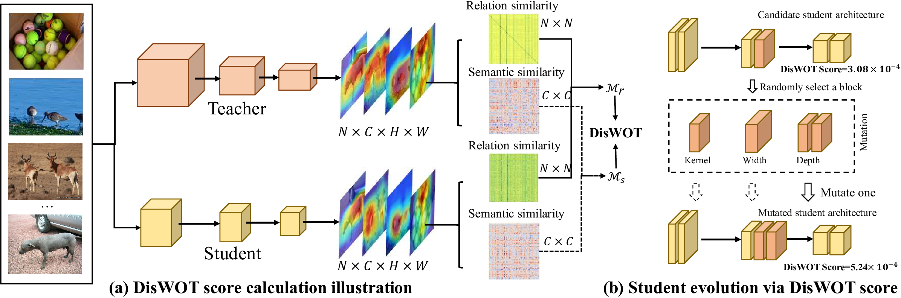

## DisWOT: Student Architecture Search for Distillation WithOut Training


## Abstract: 
Knowledge distillation (KD) is an effective training strategy to improve the lightweight student models under the guidance of cumbersome teachers. However, the large architecture difference across the teacher-student pairs limits the distillation gains. In contrast to previous adaptive distillation methods to reduce the teacher-student gap,  we explore a novel training-free framework to search for the best student architectures for a given teacher. Our work first empirically show that the optimal model under vanilla training cannot be the winner in distillation. Secondly, we find that the similarity of feature semantics and sample relations between random-initialized teacher-student networks have good correlations with final distillation performances. Thus, we efficiently measure similarity matrixs conditioned on the semantic activation maps to select the optimal student via an evolutionary algorithm without any training. In this way, our student architecture search for Distillation WithOut Training (DisWOT) significantly improves the performance of the model in the distillation stage with at least 180 training acceleration. Additionally,  we extend similarity metrics in DisWOT as new distillers and KD-based zero-proxies. Our experiments on CIFAR, ImageNet and NAS-Bench-201 demonstrate that our technique achieves state-of-the-art results on different search spaces. 



## Core Code
```python
import torch
import torch.nn as nn 
import torch.nn.functional as F

def relation_similarity_metric(teacher, student, batch_data):
    image, label = batch_data
    # Forward pass
    t_feats = teacher.forward_features(image)
    s_feats = student.forward_features(image)
    # Get activation before average pooling
    t_feat = t_feats[-2]
    s_feat = s_feats[-2]
    # Compute batch similarity
    return -1 * batch_similarity(t_feat, s_feat)

def batch_similarity(f_t, f_s):
    # Reshape
    f_s = f_s.view(f_s.shape[0], -1)
    f_t = f_t.view(f_t.shape[0], -1)
    # Get batch-wise similarity matrix
    G_s = torch.mm(f_s, torch.t(f_s))
    G_s = F.normalize(G_s)
    G_t = torch.mm(f_t, torch.t(f_t))
    G_t = F.normalize(G_t)
    # Produce L_2 distance
    G_diff = G_t - G_s
    return (G_diff * G_diff).view(-1, 1).sum() / (bsz * bsz)
 
def semantic_similarity_metric(teacher, student, batch_data):
    criterion = nn.CrossEntropyLoss() 
    image, label = batch_data 
    # Forward once.
    t_logits = teacher.forward(image)
    s_logits = student.forward(image)
    # Backward once.
    criterion(t_logits, label).backward()
    criterion(s_logits, label).backward()
    # Grad-cam of fc layer.
    t_grad_cam = teacher.fc.weight.grad
    s_grad_cam = student.fc.weight.grad
    # Compute channel-wise similarity
    return -1 * channel_similarity(t_grad_cam, s_grad_cam)

def channel_similarity(f_t, f_s):
    bsz, ch = f_s.shape[0], f_s.shape[1]
    # Reshape
    f_s = f_s.view(bsz, ch, -1)
    f_t = f_t.view(bsz, ch, -1)
    # Get channel-wise similarity matrix
    emd_s = torch.bmm(f_s, f_s.permute(0, 2, 1))
    emd_s = F.normalize(emd_s, dim=2)
    emd_t = torch.bmm(f_t, f_t.permute(0, 2, 1))
    emd_t = F.normalize(emd_t, dim=2)
    # Produce L_2 distance
    G_diff = emd_s - emd_t
    return (G_diff * G_diff).view(bsz, -1).sum() / (ch * bsz)
```


### Bibtex 


```markdown
@inproceedings{Dong2023diswot,
  title={DisWOT: Student Architecture Search for Distillation WithOut Training},
  author={Dong, Peijie and Li, Lujun and  Wei, Zimian},
  booktitle={CVPR},
  year={2023}
}

```
