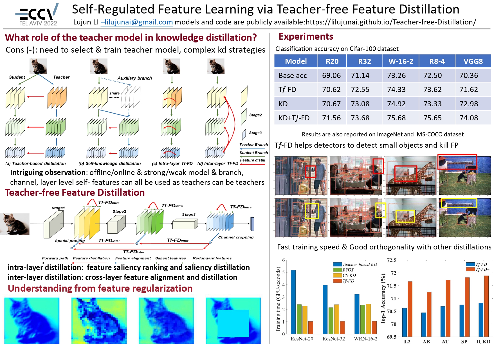

# Teacher-free Feature Distillation

This project provides Pytorch implementation for [Self-Regulated Feature Learning via Teacher-free Feature Distillation](https://lilujunai.github.io/Teacher-free-Distillation/).

**News!** A submission in my review replies to Tf-FD results on semantic segmentation, as follows, best wishes for this work！(Update： this paper has been accepted by AAAI22 under my strong recommendation!)

We have evaluated `Tf-FD' (ECCV'22) with DeepLabV3-resnet18 on Cityscapes and CamVid, as shown in the table:

| Method | Dataset | mIoU |
| --- | --- | --- |
| Student | Cityscapes| 69.19 |
| Tf-KD | Cityscapes| 70.35 |
| SAD | Cityscapes| 70.10 |
| Tf-FD | Cityscapes| 70.83 |
| Student | CamVid | 65.90 |
| Tf-KD | CamVid | 66.14 |
| SAD | CamVid | 66.50 |
| Tf-FD | CamVid | 67.01 |




## Requirements
```
` Python == 3.7, PyTorch == 1.3.1`
```

## Core Code
```python
import torch
import torch.nn as nn
import torch.nn.functional as F

class TfFD(nn.Module):
  '''
  Teacher-free Feature Distillation
  '''
  def __init__(self, lambda_intra, lambda_inter):
    super(TfFD, self).__init__()
    self.lambda_intra = lambda_intra
    self.lambda_inter = lambda_inter
    
  def forward(self, f1, f2, f3):
    loss = (intra_fd(f1)+intra_fd(f2)+intra_fd(f3))*self.lambda_intra
    loss += (inter_fd(f1,f2)+inter_fd(f2,f3)+inter_fd(f1,f3))*self.lambda_intra
    
  def intra_fd(f_s):
    sorted_s, indices_s = torch.sort(F.normalize(f_s, p=2, dim=(2,3)).mean([0, 2, 3]), dim=0, descending=True)
    f_s = torch.index_select(f_s, 1, indices_s)
    intra_fd_loss = F.mse_loss(f_s[:, 0:f_s.shape[1]//2, :, :], f_s[:, f_s.shape[1]//2: f_s.shape[1], :, :])
    return intra_fd_loss
    
  def inter_fd(f_s, f_t):
    s_C, t_C, s_H, t_H = f_s.shape[1], f_t.shape[1], f_s.shape[2], f_t.shape[2]
    if s_H > t_H:
      f_s = F.adaptive_avg_pool2d(f_s, (t_H, t_H))
    elif s_H < t_H:
      f_t = F.adaptive_avg_pool2d(f_t, (s_H, s_H))
    else:
      pass
    inter_fd_loss = F.mse_loss(f_s[:, 0:min(s_C,t_C), :, :], f_t[:, 0:min(s_C,t_C), :, :].detach())
    return inter_fd_loss 

  return loss
```


## Training
Run train_kd.py for training Tf-FD in CIFAR datasets. 

Tf-FD:

```python
python -u train_kd.py --save_root "./results/tfd/" --kd_mode tfd --lambda_inter 0.0005 --lambda_intra 0.0008 --note tfd-r20-inter-0.0005-intra-0.0008
```

Tf-FD+(Tf-FD):

```python
python -u train_kd.py --save_root "./results/tfd+/" --kd_mode tfd+ --lambda_inter 0.0005 --lambda_intra 0.0008 --note tfd+-r20-inter-0.0005-intra-0.0008
```

## Results
Most pretrained models and logs have been released on Baidu Netdisk:

link: https://pan.baidu.com/s/1F3QSX6MicA5qG5fxMOaCEg 

pwd: tffd

## Acknowledgements
This repo is partly based on the following repos, thank the authors a lot.
- [HobbitLong/RepDistiller](https://github.com/HobbitLong/RepDistiller)
- [Knowledge-Distillation-Zoo](https://github.com/AberHu/Knowledge-Distillation-Zoo)

## Citation
If you find that this project helps your research, please consider citing some of the following papers:

```
@inproceedings{li2022TfFD,
    title={Self-Regulated Feature Learning via Teacher-free Feature Distillation},
    author={Lujun, Li},
    booktitle={European Conference on Computer Vision (ECCV)},
    year={2022}
}
```

